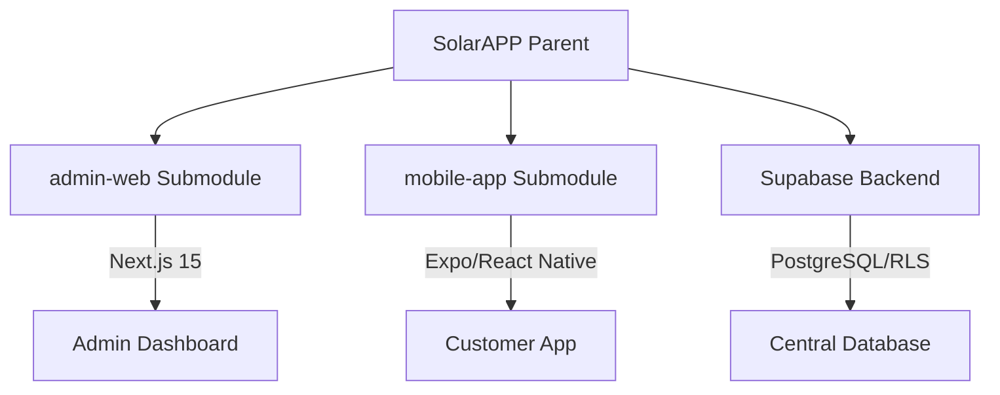

# SolventZ Solar Solutions - Ecosystem Root

[](https://admin-web-psi-lovat.vercel.app)
[](docs/project/Architecture.md)
[](LICENSE)

The **SolventZ Solar Solutions** platform is a comprehensive digital ecosystem designed to streamline solar energy adoption. This repository serves as the **Parent Module**, orchestrating the various components of the platform through Git submodules.

## 🏗 Architecture Overview

The system follows a modern, distributed architecture leveraging Supabase as a centralized Backend-as-a-Service (BaaS).



## 📁 Repository Structure

| Component | Description | Tech Stack |
|-----------|-------------|------------|
| [**`admin-web/`**](https://github.com/muntakim1/SolarApp-admin) | Management Dashboard | Next.js 15, Tailwind, Lucide |
| [**`mobile-app/`**](https://github.com/muntakim1/SolarApp-Mobile) | Customer Mobile Experience | Expo, React Native, Zustand |
| **`supabase/`** | Database & Backend Logic | PostgreSQL, GoTrue, RLS |
| **`docs/`** | Technical Documentation | Markdown, Mermaid.js |
| **`scripts/`** | Dev & Deployment Tools | Shell, Node.js |

## 🚀 Getting Started

### Prerequisites
- Node.js (v18+)
- npm or yarn
- Git

### Initial Setup (Cloning)
To clone the entire ecosystem, including all submodules:
```bash
git clone --recursive https://github.com/muntakim1/SolarApp.git
cd SolarApp
```

If you have already cloned the parent repo and need to pull submodules:
```bash
git submodule update --init --recursive
```

### Running Locally

1.  **Backend (Supabase)**:
    Refer to [docs/supabase/SUPABASE_SETUP_GUIDE.md](docs/supabase/SUPABASE_SETUP_GUIDE.md) for local migration setup.
2.  **Admin Panel**:
    ```bash
    cd admin-web && npm install && npm run dev
    ```
3.  **Mobile Application**:
    ```bash
    cd mobile-app && npm install && npx expo start
    ```

## 📖 Key Documentation

- 🗺 **[User Flows](docs/project/Userflow.md)**: Visual representation of customer and admin journeys.
- 📐 **[System Architecture](docs/project/Architecture.md)**: Deep dive into the technical stack and RLS security model.
- 🧪 **[Master Test Plan](docs/qa/Master_Test_Plan.md)**: Comprehensive QA strategy for the entire ecosystem.
- 📊 **[Project Status](docs/project/PROJECT_STATUS_REPORT.md)**: Current roadmap and feature completion matrix.

## 🤝 Contributing

Please read [CONTRIBUTING.md](CONTRIBUTING.md) for details on our code of conduct and the process for submitting pull requests.

## 📄 License

This project is licensed under the MIT License - see the [LICENSE](LICENSE) file for details.

---
*Developed with ❤️ by the SolventZ Engineering Team*
