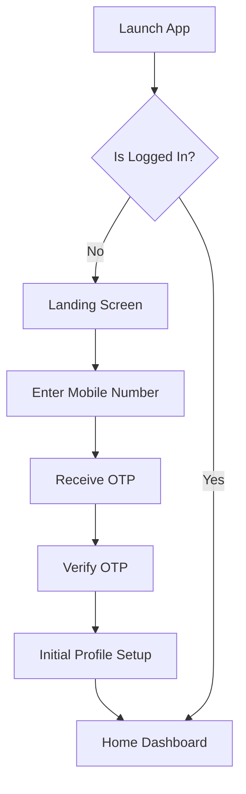
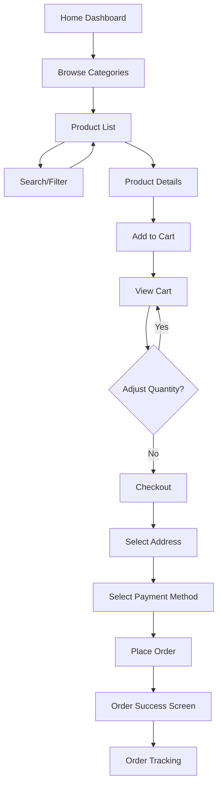
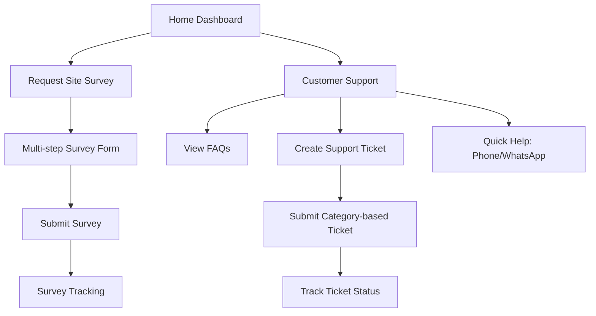
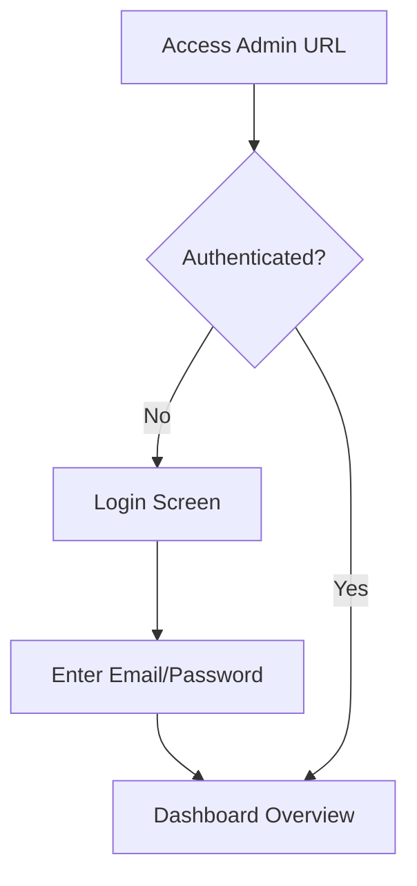
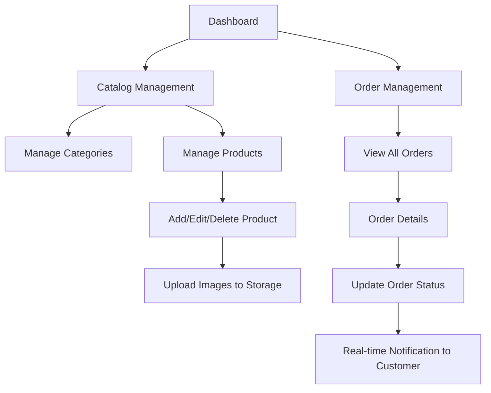
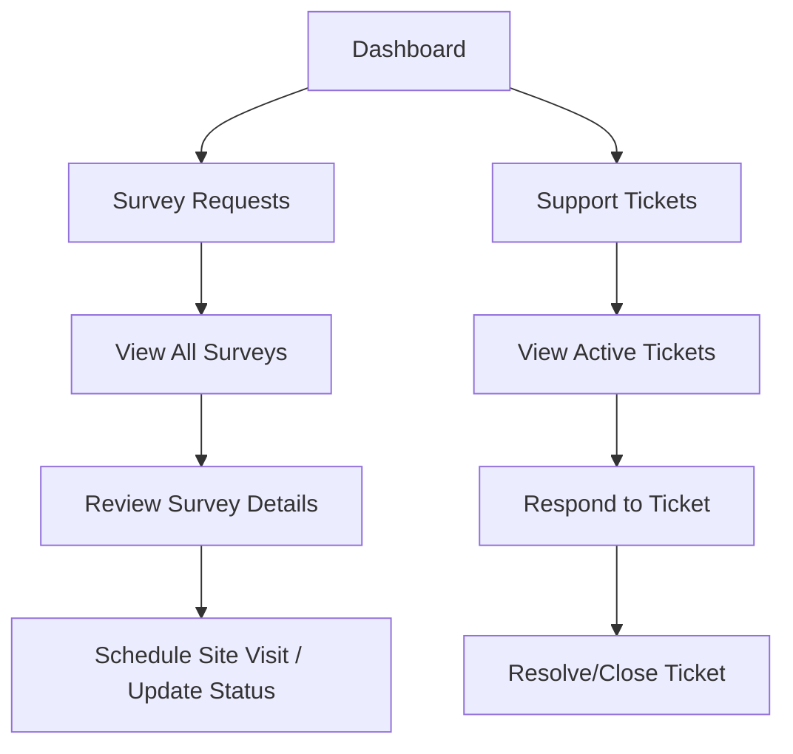

# User Flows - SolventZ Solar Solutions

This document outlines the primary user journeys within the SolventZ Solar Solutions platform for both Customers (Mobile App) and Admin Staff (Web Panel).

## 1. Customer User Flow (Mobile Application)

The customer flow focuses on product discovery, seamless ordering, and requesting professional solar services.

### 1.1 Authentication & Profile Setup

### 1.2 Product Discovery & Ordering

### 1.3 Site Survey & Support

---

## 2. Admin User Flow (Web Panel)

The admin flow is designed for staff to manage operations efficiently from a centralized dashboard.

### 2.1 Staff Authentication & Dashboard

### 2.2 Catalog & Order Management

### 2.3 Survey & Ticket Handling

